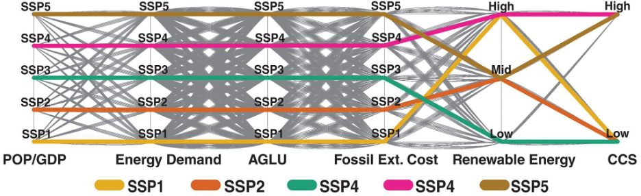

.. _design:

************************
Experimental Design
************************

Designing a scenario discovery experiment with GCAM is centered around the construction of a large scenario ensemble of model runs. This is typically the most difficult and laborious step of the process, but spending the time to develop a rich and impactful ensemble of realizations will provide the greatest return on the quality of the final research product, and will increase opportunities for leveraging the ensemble in additional projects and new collaborations. There is no set threshold of unique model simulations to reach in order to constitute a “large ensemble” but the output must sufficiently explore an uncertainty space relevant to the research questions. Organizing thoughts and ideas about relevant uncertainties can be facilitated by the use of existing frameworks for modeling uncertainty. One such technique is the “XLRM” framework commonly deployed in RDM circles, articulating and delineating the relevant eXogenous uncertainties, strategy Levers, modeled Relationships, and performance Measures (metrics) :cite:p:`lempert2003shaping`. Developing the intellectual basis for an ensemble using this framework can be done by answering the following questions:

Which uncertain exogenous parameters should be varied within the scenario configurations?
------------------------------------------------------------------------------------------

This list will constitute the parametric uncertainty space covered by the ensemble. Generally, this will be informed by a review of the relevant literature, conversations with stakeholders, and specific research goals to be achieved. Some possibilities for what to include could be a combination of: 

- Parameters commonly shown to be important drivers of your relevant outcomes (e.g., water availability on crop production)
- Under-explored and deeply uncertain parameters
- Parameters for which there is ambiguity in how their uncertainty will propagate
- Parameters of which the model’s representation is particularly strong or detailed
- Parameters which are highly connected to many different systems (e.g., population).

Determining the Number of Variable Parameters
______________________________________________

In addition to literature review and expert elicitation, the makeup of a scenario ensemble will also be bound by practicality. Because each new sensitivity will multiply the ensemble size, there will be a realistic limit based on total computation time and storage capacity for the resulting databases. Similarly, it must also be determined how many discrete values a parameter can take on. For example, ten sensitivities with two unique values each will result in the same number of model runs as four sensitivities with five unique values each. Another consideration regarding practicality is estimating the amount of time before data obsolescence. In a constantly evolving field focused on modeling future states of the world, the relevance of forecasts wanes over time, so a balance must be struck between coverage and speed.

What are the plausible ranges for each sensitivity?
____________________________________________________

This can be determined through literature review, where extreme bounds can be chosen to cover the widest possible range, or simply the most common. Additionally, some parameters may be bounded by their zero-sum complementarity with competing options, or physics of natural processes. 

Should every single combination of inputs be included and run?
_______________________________________________________________

A full factorial sampling will be the most detailed implementation of the ensemble, but depending on the experiment, may not be the most appropriate method. Because the number of realizations scales exponentially, it may be necessary to sample the possible configurations based on a Latin hypercube sampling, a probabilistic analysis, or eliminating implausible or redundant configurations. For continuous parameters, it is possible to sample from a low-discrepancy sequence, such as a Sobol sequence, rather than combinations of discrete levels, in order to fill the parameter space with fewer points.

   Courtesy of :cite:t:`lamontagne2018large`: Strategy for sampling the SSP space. The SSP assumptions are aggregated into six sampling dimensions, each having a number of discrete sampling levels composed of a distinct set of assumptions (i.e., input data and GCAM parameter values). The five canonical SSPs are shown in bold color. A full factorial sampling is applied.

What strategy-related scenario factors, if any, should be included in the ensemble?
------------------------------------------------------------------------------------

Strategy-related factors can add an additional dimension to a scenario ensemble (or be the main focus), and can include anything from emissions reductions to land conservation to embargoes to representative taxes and subsidies. These will scale the size of an ensemble the same way a parametric sensitivity will.

Do sufficient linkages exist in the model to examine the dynamics being studied?
---------------------------------------------------------------------------------

This is an important consideration and could require developing new relationships within the model to properly represent connections between systems or simply adding detail to a sector.

Which performance metrics are needed to perform the analysis, and are they available in the model?
---------------------------------------------------------------------------------------------------

Collecting the information necessary to construct a large ensemble can be made easier through the use of a scenario matrix; for example:

.. list-table::
   :widths: auto
   :header-rows: 1

   * - Uncertain parameter
     - Number of unique cases
     - Description of each case
     - Files necessary to run it
     - Plain language description
     - Technical representation in model
     - Source(s)
   * - SSP
     - 5
     - SSP1, SSP2, SSP3, SSP4, SSP5
     - e.g., list of XML’s
     - Shared socio-economic pathways are…
     - Changes GDP, tech. costs, etc. …
     - `GCAM SSP documentation <https://jgcri.github.io/gcam-doc/ssp.html>`_
   * - Climate scenario
     - 2
     - With climate targets vs. w/o climate targets
     - e.g., list of XML’s
     - Limiting world to 1.5°C
     - Uses target finder to…
     - IPCC Report
   * - ...
     - ...
     - ...
     - ...
     - ...
     - ...
     - ...

Following this, the uncertain parameters must be translated into specific technical representations in GCAM. For some, updating coefficients in core XML files could be sufficient, but the recommended method is to instead update input CSV files and rerun the GCAM data system to generate new XML files. Refer to the `documentation for gcamdata <https://jgcri.github.io/gcamdata/index.html>`_ for more information on changing the data system, as well as `GCAM’s documentation for constructing policies <https://jgcri.github.io/gcam-doc/policies.html>`_.
