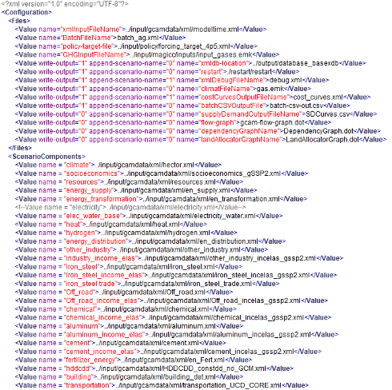

.. _run:

************************
Running an experiment
************************

After the experimental design phase, each individual uncertainty lever across the ensemble should be run through GCAM in isolation and its outputs examined, in order to verify the expected behavior and compare it to previous work as well as the broader literature. One example could be to check if a customized carbon emissions scenario actually represents emissions as intended and solves properly, or if add-on files need to be read in a different order. This is necessary to ground truth isolated effects and could save significant troubleshooting time later on. Of course, in a full factorial ensemble, there will be a subset of realizations which only vary a single sensitivity, but it should be confirmed to behave as intended before committing the full computational power. Some of the diagnostic metrics used should be relevant to the sensitivity you are testing, but for completeness, any metric used to sanity check a sensitivity implementation should be examined for every individual sensitivity being tested. This will form a set of diagnostic metrics unique to the ensemble, which can be presented as a multi-panel figure for each test. Note that these metrics may be different from those used in the final analysis. Take note as well if any of the sensitivities significantly increase the model runtime, and account for it when estimating the time the model runs will take.

Two methods for running large numbers of GCAM realizations are 1) creating a unique configuration file for each run; and 2) running GCAM in `batch mode <https://jgcri.github.io/gcam-doc/user-guide.html#gcam-batch-mode>`_. To automate the creation of configuration files for every model run (Method 1), XML editing packages such as those in `Python <https://docs.python.org/3/library/xml.etree.elementtree.html>`_ and `R <https://cran.r-project.org/web/packages/XML/XML.pdf>`_ can be used. In addition to adding, removing, and changing various XML files to construct each configuration, the user should deploy here a suitable naming convention for scenarios, as well as a folder hierarchy for grouping and storing scenario databases by sensitivity. Limiting to 100-200 databases in a single subdirectory can help organizationally. It can also be helpful to store the configuration files in a similarly structured hierarchy. In either method, note that the order in which the XML input files are listed in the configuration file can affect model behavior.

   Excerpt of a partial GCAM configuration file.

For large, computationally intensive modeling scenario ensembles, it is recommended to use a high-performance computing cluster, rather than a personal computer. An organized folder hierarchy for completed runs is highly recommended for keeping track of overall progress as well as potential issues which may arise. A database being written after a model run is complete does not confirm a “good” model run (certain model periods may have failed in ways deemed unacceptable for the project), so simply counting the number of databases generated may not accurately measure progress, and could skip over “bad” runs. In a linux-based HPC environment, checking the quality of completed runs as well as failure modes of unsuccessful jobs can be done using bash scripts which check the contents of each job’s output and error logs. Consistent errors in scenarios which all share the same sensitivity or combination of sensitivities could signal an issue with its implementation in GCAM. Alternatively, such scenarios could simply be infeasible. If some realizations contain markets which did not solve, a quick fix could be to increase the iteration `count in <https://jgcri.github.io/gcam-doc/solver.html#Solver-Configuration-File>`_ the solver file. This is common when implementing changes that increase the model runtime, such as policies or adding new markets.

Thus, different types of errors should be noted and grouped together, so that these scenarios can be re-run with potentially different fixes for each failure mode. This can be done by collecting the scenario names from the output log files and constructing lists of configuration files to be re-run as necessary. Note that it is convenient if the configuration filename is identical to or contains the scenario name.

A final consideration for running an experiment is the reproducibility and data storage plan of the ensemble. If the scenarios are simple, run quickly, and have a very low failure rate, perhaps only the add-on files need to be saved along with the script to generate the configuration files or the batch input file. However, full model output databases could also be hosted on MSD-LIVE or Zenodo, so that users without GCAM experience can perform analyses on a large GCAM ensemble. Another option is to automate a workflow for querying each model run immediately after completion to extract the desired information, and then deleting the bulkier database. This can save significant storage space, but does not allow for future work to access different queries than what was initially obtained.
